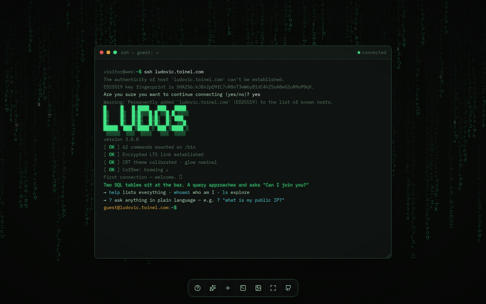

# Terminal.com

[](https://github.com/ltoinel/Terminal.com/actions/workflows/ci.yml)
<!-- badges:dynamic -->


<!-- /badges:dynamic -->


[](LICENSE)

Personal portal — **[Astro](https://astro.build) + [Tailwind CSS](https://tailwindcss.com) v4**.
Static site, **terminal / phosphor aesthetic**, zero framework JS, with built-in SEO
and schema.org structured data. Config-driven and reusable: every site-specific
value (host, identity, links) lives in **`src/site.config.ts`**.



**Design**: a draggable, resizable terminal window over a desktop. Seven CRT
themes (`green` with a "Matrix" digital-rain background, `amber`, `ice`,
`synthwave`, `cyberpunk` with an animated neon-grid background, `white`, `red`)
and switchable wallpapers. A bottom dock gives one-click access to `help` (a
clickable command palette), the local AI agent (**ask AI**), a new shell window,
the theme / wallpaper switchers, fullscreen and the source code (**fork me on
GitHub**). Fonts **VT323** (CRT display) and
**IBM Plex Mono** (body). Effects: scanlines, grain, vignette, phosphor glow,
blinking cursor — all disabled under `prefers-reduced-motion`.

## Requirements

- Node.js ≥ 22.18 — native TypeScript execution for `scripts/`, `server/` and the
  tests (CI runs the latest Node 22).
- For the `msg` command only: a local MTA exposing `sendmail` (e.g. Postfix) on the
  server. The site itself is fully static.

## Getting started

```bash
npm install
npm run dev      # dev server with HMR -> http://localhost:4321
```

## Scripts

| Script                   | Purpose                                                       |
| ------------------------ | ------------------------------------------------------------- |
| `npm run dev`            | Development server (hot reload)                               |
| `npm run build`          | Optimized static build → `dist/`                              |
| `npm run preview`        | Preview the `dist/` build                                     |
| `npm run check`          | Type checking / Astro diagnostics                             |
| `npm run check:commands` | Validate + lint the commands (`root/bin/*.md`)                |
| `npm test`               | Unit tests (Vitest)                                           |
| `npm run coverage`       | Tests + coverage report, refreshes the README badges          |
| `npm run test:ci`        | Tests + JUnit / Cobertura reports (used by Azure DevOps)      |
| `npm run test:watch`     | Tests in watch mode                                           |
| `npm run lint`           | ESLint                                                        |
| `npm run format`         | Format the code (Prettier)                                    |
| `npm run format:check`   | Check formatting without writing                              |
| `npm run msg-server`     | Run the `msg` email relay locally (needs `MSG_TO`, see below) |
| `npm run upgrade`        | List dependency updates                                       |
| `npm run upgrade:apply`  | Apply updates + rebuild                                       |

All of these checks (`format:check`, `lint`, `check:commands`, `check`, `test`, `build`)
run automatically in CI on every _push_ and _pull request_ — on GitHub Actions
(`.github/workflows/ci.yml`) and on Azure DevOps (`azure-pipelines.yml`, which also
publishes the unit-test results and the code coverage to the run's _Tests_ and
_Code Coverage_ tabs, via `npm run test:ci`).

## Structure

```
public_html/
├── astro.config.mjs          ← Astro config (reads the URL from site.config.ts)
├── src/
│   ├── site.config.ts        ← ⭐ SINGLE SOURCE: identity, SEO, shell, links/profiles
│   ├── pages/index.astro     ← home page (terminal + dock)
│   ├── pages/[command].astro ← one static page per command/document (deep links)
│   ├── pages/sitemap.xml.ts  ← generated sitemap
│   ├── pages/sw.js.ts        ← service worker, generated (content-derived cache version)
│   ├── pages/shell-*.json.ts ← externalised FS tree + command registry (fetched once)
│   ├── layouts/Layout.astro  ← <head>, SEO, Open Graph, theme, fonts, SW + update toast
│   ├── components/           ← Terminal, Dock (+ its buttons), LlmWidget, JsonLd, MatrixRain
│   ├── lib/terminal.ts       ← shell session: I/O, prompt, completion, the `ctx` object
│   ├── lib/executor.ts       ← pipelines (`|`), redirections (`>`, `>>`), headless capture
│   ├── lib/shell-parse.ts    ← command-line lexer/parser (quotes, pipes, redirections)
│   ├── lib/shell-ctx.ts      ← typed `ctx` API contract for the commands
│   ├── lib/vfs.ts            ← virtual filesystem (paths, su, persisted mutations)
│   ├── lib/llm.ts            ← the single WebLLM loader / engine manager
│   ├── lib/windows.ts        ← window chrome (drag, raise, min/max) + iframe windows
│   ├── lib/content.ts        ← walks root/ at build time → FS tree + command registry
│   ├── lib/commands.ts       ← command parsing + validation (shared)
│   ├── lib/html.ts           ← HTML escaping / safe links (client + build)
│   └── styles/global.css     ← Tailwind + terminal themes (CSS variables, CRT effects)
├── root/                     ← ⭐ THE FAKE FILESYSTEM (a real on-disk directory tree)
│   ├── bin/                  ← one command = one markdown (frontmatter + optional js)
│   ├── home/guest/           ← visitor's ~ : docs browsed via ls/cat (about/projects/contact)
│   └── etc/, var/, usr/, …   ← explorable "decor" directories
├── server/                   ← `msg` email relay (Node, zero dependencies)
├── public/                   ← served as-is (icons, fonts, manifest, OG image, vendor/)
├── deploy/*.template         ← nginx, systemd unit, relay env (rendered by deploy:config)
├── scripts/                  ← site-config bootstrap + command validation
├── tests/                    ← Vitest tests (parsing, execution, VFS, rendering, relay)
├── docs/screenshot.png       ← the screenshot above
└── dist/                     ← GENERATED OUTPUT (= the web root to serve)
```

## Editing the content

- **Identity, SEO and profiles** → **`src/site.config.ts`**: name, role, company,
  tagline, bio, URL, OG image, Twitter handle, Google token, and the `links` list
  (each entry feeds the `open` command, the schema.org `sameAs`, or both).
- **Browsed content** → the **`root/`** tree (see "Interactive shell").

The dock tiles are components in `src/components/`. **help** and **ask AI** run
`help` / `denree` in the shell window the visitor used last, through
`runCommandLine()` (`src/lib/terminal.ts`); `help` lists every command and file
as clickable links. The **fork me on GitHub** tile links to `site.sourceUrl`
(set it to an empty string to hide it). The dock buttons use [astro-icon](https://www.astroicon.dev/) with the `lucide` set.

## Reusing this portal

> **`src/site.config.ts` is gitignored** (it holds your personal identity). It is
> created automatically from **`src/site.config.example.ts`** on `npm install`
> (and on any `dev`/`build`/`check`/`test` run). An existing file is never
> overwritten — copy it by hand with `cp src/site.config.example.ts src/site.config.ts`
> if you prefer.

1. Edit **`src/site.config.ts`** (identity, URL, profiles, shell host/user).
2. Replace the contents of **`root/home/<user>/`** (your `.md` documents; `<user>`
   is `shell.user`, e.g. `guest`) and, if needed, the "decor" files under
   `root/etc`, `root/var`, etc.
3. Add/remove commands in **`root/bin/`** (see below).
4. Replace the icons (`public/icons/*`, `public/favicon.ico`, `public/apple-touch-icon.png`)
   and the OG image (`public/ludovic-toinel.jpg`).
5. `npm run lint && npm test && npm run build`.

> The home directory (`shell.home`) must stay consistent with the
> `root/home/...` tree.

## Interactive shell

On load, the portal simulates an **SSH connection** to the configured host
(`shell.host` in `src/site.config.ts`) and prints the message of the day
(`motd`), then hands over control. The visitor then types commands to explore
the content. The window is **draggable** (grab the title bar), **resizable**
(handle at the bottom right) and has close / minimize / maximize buttons
(double-click the bar to maximize); the dock's **+** opens more shell windows.

**The content lives in the `root/` tree (= the fake filesystem):**

- **`root/home/<user>/`** (the `shell.user`, e.g. `guest`) = the visitor's `~`
  directory: documents browsed with `ls` / `cat` (`about.md`, `projects.md`,
  `contact.md`). To **add a document**, create `root/home/<user>/my-file.md`: it
  becomes reachable via `cat my-file.md` (or just `my-file`), shows up in `ls` and
  gets its own `/my-file` page.

- **`root/bin/`** = **one command = one markdown**; the build (`content.ts`)
  discovers commands automatically by listing this directory (they also appear
  in `/bin`). Frontmatter:
  - `name`: command name
  - `desc`: description (shown by `help`)
  - `alias` (optional): comma/space-separated alternate names (e.g. `cls` → `clear`)
  - `page: false` (optional): no standalone `/<name>` landing page — for control
    commands, argument-required utilities and side effects
  - `index: false` (optional): the landing page exists but stays out of search
    engines (`noindex`, not in the sitemap) — for thin pages with no search intent
  - `demo` (optional): a command line the landing page runs instead of opening the
    manual (e.g. `demo: cal`, `demo: nslookup %HOST%`), so `/cal/` shows a calendar
  - `man: |` (optional): authored manual page, shown by `man <name>`
  - `js: |` (optional): JavaScript executed if the command is **dynamic**
  - the **markdown body**: shown as-is if the command is **static** (no `js`)

  ```markdown
  ---
  name: date
  desc: date and time
  js: |
    ctx.line(new Date().toString());
  ---
  ```

  The `js` is an async function body receiving a **`ctx`** object — its full,
  typed contract is **`src/lib/shell-ctx.ts`**. In short:
  - input: `args`, `body`, `cfg`, `stdin` (piped input), `history`, `commands`,
    `signal` (aborted by Ctrl+C), `ask(question, { secret })`;
  - output: `print` (markdown), `line`, `raw`, `error` (stderr), `sysLine`,
    `append` (trusted HTML), `escape`, `clear`, `sleep`, `type`;
  - filesystem: `cwd`, `cwdLabel`, `cd`, `list`, `read`, `fileList`, `resolveFile`,
    and the persisted mutations `mkdir`, `touch`, `write`, `rm`;
  - session & windows: `open`, `iframe`, `theme`/`themes`/`currentTheme`, `su`,
    `exit`, `close`, `exec`, `capture(line)` (run a command line headlessly and get
    its output);
  - background work: `worker(url, name)` (a Web Worker tracked by the shell, shown
    by `top`) and `workers()`;
  - `llm`: the local WebLLM manager (`ensure`, `chat`, `models`, `catalog`,
    `recommended`, cache ops, `unload`, `interrupt`, `state`).

  > Files in `root/bin/*.md` are validated at build time and by `npm run check:commands`:
  > frontmatter, name, **JS syntax** (parsed, never executed), duplicates — plus an
  > **ESLint** pass (recommended rules) over every `js:` block.

The command line supports pipes (`ls | grep md | wc -l`), output redirection
(`echo hi > notes.txt`, `>>` to append) and single/double quotes
(`grep "a | b" notes.txt`).

Supported markdown: `# Title`, `## Subtitle`, `> note`, `- bullet`,
`**bold**`, `` `code` `` and links `[text](https://…)` or `[…](mailto:…)`.

> ⚠️ Dynamic commands run via `AsyncFunction` (eval). Only allow **trusted**
> commands. The deployed CSP (`deploy/nginx.conf.template`) is therefore a hardening
> layer, not a sandbox: it allows `unsafe-eval` (for the command engine) and
> `blob:` workers (for `hashcat`).

**Built-in commands**

- _Filesystem_: `ls`/`ll`, `cd`, `pwd`, `cat`, `tree`, `find`, `grep`, `wc`,
  `mkdir`, `touch`, `rm` (FS mutations persist per-browser in `localStorage`).
- _System / identity_: `whoami`, `uname`, `date`, `echo`, `motd`, `su`/`sudo`,
  `theme`, `bell`, `clear`/`cls`, `history`, `help`, `man`, `boot`, `exit`,
  `shutdown`/`reboot`.
- _Network_: `nslookup`, `whois`, `ping`, `httperf`, `httpstest`, `checkip`,
  `useragent`, `weather`, `open <name>`, `iframed <url>`.
- _Tools / crypto_: `bc`/`calc`, `base64`, `sha256sum`, `md5sum`/`md5`, `jwt`,
  `uuid`, `password`/`pwgen` (unbiased `crypto.getRandomValues` generator), `qr`,
  `hashcat` (multi-core MD5 brute-forcer using Web Workers).
- _Productivity_: `todo`/`task` (task list in localStorage), `kanban`/`board`
  (the same tasks as a Unicode board), `pomodoro`/`pomo` (background focus timer
  with a chime and a flash), `cal`/`calendar` (month / year grid, ISO
  weeks).
- _System monitor_: `top`/`htop` — live JS heap (`performance.memory`), device
  hints, LLM engine, service worker and the Web Workers started by commands.
- _Fun_: `fortune`/`quote` (quote or developer joke from public APIs, offline
  fallback), `say`/`tts` (speech synthesis), `asciiart`/`banner` (big text in ten
  styles — block, shadow, 3d, slant, …).
- _Local AI (WebGPU, fully in-browser)_: `llm` (engine / cache manager),
  `miaougpt`/`chat`, `glaude`/`soupe`, `denree`/`?` (a reasoning agent that
  drives the terminal: it plans, chains commands — one result feeding the next —
  reflects on each output and critiques its candidate answers; with no question
  it asks for one), `webllmfit` (which
  models fit this machine). No model is downloaded
  without consent; the top-right widget shows the loaded model and token counts.
- _Messaging_: `msg <text>` emails the owner (see below).

**Each command carries its own code**: a `root/bin/*.md` file is
self-contained — readable JS, no third-party library, no command-specific module
(`todo` and `kanban` share their tasks through the `ltsh.todo` localStorage key,
`qr` embeds its own QR encoder, `asciiart` its own pixel font). `src/lib/` holds
only the transverse core engine; its one third-party runtime library is the
WebLLM engine, loaded lazily on first use. Command logic is unit-tested by
running the `.md` itself against a fake `ctx` (`tests/run-command.ts`).

`su` simulates switching to root (a `#` prompt, access to `/root`); `exit` returns
to the user. Plus: persistent history (↑/↓), autocompletion (Tab), line editing
(`Ctrl+A/E/U/K/W`), `Ctrl+L` (clear), `Ctrl+C` (interrupts a running command).

> **SEO**: the terminal requires JavaScript (no static fallback). Search ranking
> therefore relies on the `<head>`: `<title>`, meta description, Open Graph,
> Twitter Card and above all the **`Person` JSON-LD** (server-rendered, so
> readable without running JS). The per-command pages (`[command].astro`) also
> emit each command's manual as crawlable, server-rendered HTML.

## Film, TV & video productions

This terminal can be used as an **on-screen prop** in films, series, ads or
video games — the "hacker at work" or "mainframe console" screen — and it is
built to be easy to stage:

- **Looks the part**: a real, responsive shell with a believable SSH boot
  sequence, typewriter output and CRT effects (scanlines, glow, grain). Seven
  color themes match the grading of a scene: green Matrix rain, amber, ice,
  synthwave, cyberpunk neon grid, white, red.
- **Actually works**: everything on screen is real and repeatable take after
  take — `top` monitors live memory, `hashcat` cracks an MD5 hash on every CPU
  core, `nslookup`, `whois`, `ping` and `httpstest` query real networks,
  `asciiart` prints big banners, and `denree` shows an AI agent reasoning step
  by step.
- **Any name, any machine**: the prompt shows the domain the page is served
  from, so serving it as `mainframe.acme` (an `/etc/hosts` entry is enough)
  makes the prompt read `guest@mainframe.acme`. The identity, the files
  (`root/`) and the boot text are plain config and markdown.
- **Scripted scenes**: a command is one markdown file (`root/bin/*.md`), so a
  plot-specific command — a fake "access granted" sequence, a countdown, a
  decoding animation — takes minutes to write. Landing on `/<command>/` runs it
  straight away (see `demo:` in "Interactive shell"), so a scene can start on
  cue from a URL.
- **Clean shots**: the dock's fullscreen button hides the browser chrome;
  `prefers-reduced-motion` turns off every animation when a still frame is
  needed; it runs offline (`npm run build && npm run preview`) except for the
  commands that query the internet.

**Rights**: the code is under the [MIT license](LICENSE), which allows
commercial use, productions included. The fonts (VT323, IBM Plex Mono) are under
the SIL Open Font License. The optional wallpapers come from Unsplash — check
the Unsplash license for your use, or turn them off. Replace the personal
identity and links (`src/site.config.ts`, `root/home/`) and any third-party
brand before shooting. An on-screen or end-credit mention is appreciated but not
required; open an issue on GitHub if you use it — it is always nice to know.

## `msg` email relay

`msg <text>` POSTs the message to **`/api/msg`**. nginx proxies that path to
**`server/msg-server.ts`**, a tiny zero-dependency Node process listening on
loopback, which emails the text to the owner through the local MTA
(`sendmail -t -i`). The visitor's text only ever lands in the email body, never
in a header.

Abuse protection: per-IP cooldown (20 s), per-IP daily quota (15), global daily
quota (120), 300-character limit, foreign `Origin` refused. The client IP is
nginx's `X-Real-IP` (from `$remote_addr`, so it cannot be forged by the visitor).
The pure logic (sanitizing, limiter, email builder) lives in `server/msg.ts` and
is unit-tested.

Configuration is read from the environment (see `deploy/msg.env.template`):
`MSG_TO` (required), `MSG_FROM`, `MSG_HOST`, `MSG_PORT`, `MSG_ORIGIN`, `MSG_LOG`,
`SENDMAIL`.

**Deploy steps** (once):

```bash
npm run deploy:config            # renders deploy/generated/ for this domain & path
sudo cp deploy/generated/msg.env ../msg.env        # then set MSG_TO
sudo cp deploy/generated/msg-relay.service /etc/systemd/system/
sudo systemctl daemon-reload && sudo systemctl enable --now msg-relay
# install deploy/generated/nginx.conf as the site's server block, then:
sudo nginx -t && sudo systemctl reload nginx
```

## PWA & service worker

`src/pages/sw.js.ts` generates `/sw.js` at build time with a content-derived
cache version. It caches the externalised shell data and — via `Layout.astro` —
surfaces an **"update available" toast** when a new build's service worker is
waiting. Manifest and icons (theme-colored terminal glyph) live in `public/`
(`manifest.json`, `icons/`).

## SEO & structured data

Generated from **`src/site.config.ts`**; the `<head>` lives in `src/layouts/Layout.astro`
and the structured-data block in `src/components/JsonLd.astro`:

- `<title>`, meta description, canonical, `theme-color`
- Open Graph + Twitter Card (image: `public/ludovic-toinel.jpg`, 800×800)
- `schema.org/Person` JSON-LD (jobTitle, worksFor, birthPlace, **sameAs** — the
  profiles flagged `sameAs` in `site.config.ts`)
- Generated sitemap (`/sitemap.xml`) + `robots.txt`
- A visible breadcrumb on every sub-page (`~ / page`), matching its
  `BreadcrumbList`
- The 404 page is `noindex`, has no canonical and no `WebPage` markup; nginx
  answers unknown URLs with a real 404 status (no soft 404 — see
  `deploy/nginx.conf.template`)

## Deployment

The **web root (DocumentRoot)** must point to **`dist/`**; the relay's env file
(`msg.env`) sits outside it. The server block is rendered from
**`deploy/nginx.conf.template`** by `npm run deploy:config`
(static serving + the `/api/msg` proxy + security headers/CSP).

```bash
npm install && npm run build   # -> dist/
```
